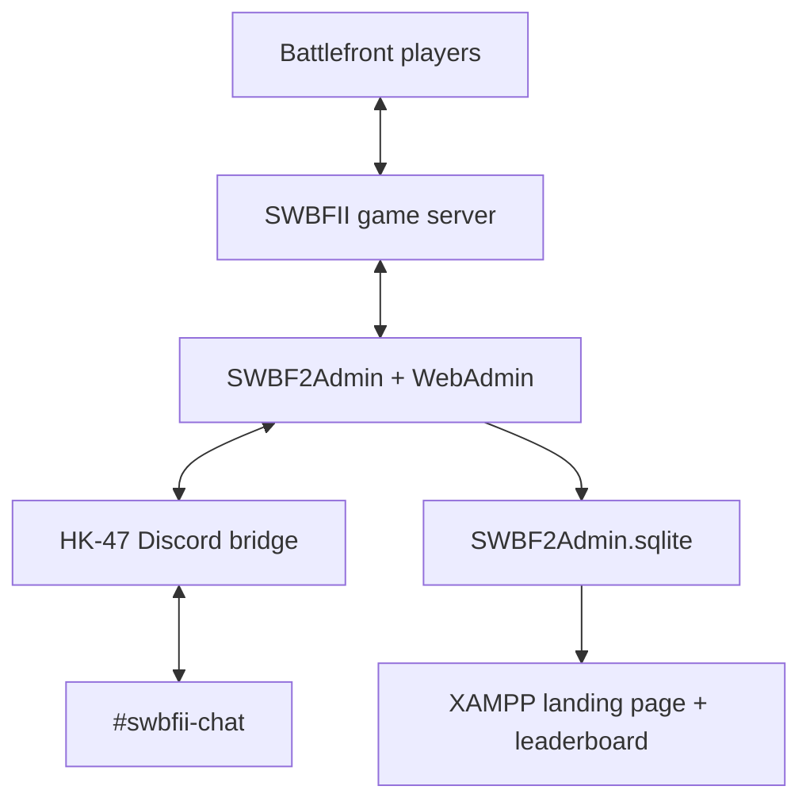

> **Total disaster-recovery manual for _PGN - Ewok Around and Find Out_**  
> Last verified: **September 11, 2026**

If you are reading this in 2036 with a blank Windows server and absolutely no memory of how any of this worked: breathe, make coffee, and follow **[Full restoration from scratch](#full-restoration-from-scratch)** in order. Do not improvise the directory names.

This repository contains the custom configuration and source code for:

- The GOG edition of **STAR WARS Battlefront II (Classic, 2005)**
- **SWBF2Admin/WebAdmin**
- The two-way **Discord ↔ game chat bridge** (`HK-47`)
- The **SvelteKit/Tailwind landing page** and seasonal leaderboard
- The PowerShell exporter used to build a safe GitHub backup

It intentionally does **not** contain the installed game, third-party executables, passwords, tokens, runtime logs, or the live player database.

---

## The rule that keeps the public server alive

> [!CAUTION]
> **NEVER start, restart, administer, or even open the server desktop with Windows Remote Desktop Connection (RDC/RDP).**

SWBF2Admin's official documentation warns that GOG Galaxy communications do not work properly over Windows RDP and that components launched through RDP can disappear from the public master list. This was also reproduced on this server: the server remained public and joinable for nearly 24 hours under Chrome Remote Desktop, then stopped being reachable after an RDC session was opened.

Use one of these instead:

- **Chrome Remote Desktop (CRD)** — current known-good method
- **VNC** — acceptable future replacement
- A physical/local console session

After using CRD, **disconnect** from it; do not sign out of Windows. Closing the CRD client does not stop the console session or game server. WebAdmin and the Discord bridge are safe to use after the server is running.

Official reference: [SWBF2Admin — Preparing the gameserver](https://github.com/jweigelt/swbf2admin#preparing-the-gameserver)

---

## System architecture



The bridge talks only to WebAdmin on `localhost`. The website reads the SQLite database in read-only mode. Neither service needs direct public RCON access.

---

## Canonical folder locations

### Live installation

These are the working files used by the running server. **Do not rename or move them** after shortcuts and the Discord scheduled task have been created.

```text
C:\PGN\SWBFII\
├── DiscordBridge\
│   ├── src\
│   ├── test\
│   ├── node_modules\                 generated; never commit
│   ├── .env                          secret; never commit
│   ├── .env.example
│   ├── bridge.log                    runtime log; never commit
│   ├── package.json
│   ├── package-lock.json
│   ├── setup.bat
│   ├── start_bridge.bat
│   ├── install_autostart.ps1
│   └── uninstall_autostart.ps1
│
├── Star Wars - Battlefront 2\        GOG game installation
│   └── GameData\
│
├── SWBF2Admin\
│   ├── SWBF2Admin.exe
│   ├── SWBF2Admin.sqlite             live stats/users/bans DB; private backup only
│   ├── cfg\
│   │   ├── core.xml
│   │   ├── game.xml
│   │   ├── players.xml
│   │   ├── announce.xml
│   │   ├── cmd\
│   │   └── dyncmd\
│   └── server\
│       ├── BattlefrontII.exe
│       └── settings\
│           ├── ServerSettings.cfg
│           └── ServerRotation.cfg
│
├── DiscordBridge-setup.bat - Shortcut   optional convenience shortcut
├── DiscordBridge-start.bat - Shortcut   optional convenience shortcut
└── SWBF2Admin.exe - Shortcut             optional convenience shortcut
```

The root-level `.lnk` shortcuts are conveniences only. They are deliberately excluded from Git and can be recreated by right-dragging the corresponding live file and choosing **Create shortcuts here**.

### Git repository working folder

```text
C:\PGN\repos\swbfii-server\
├── README.md
├── .gitignore
├── discord-bridge\                   safe copy of bridge source
├── swbf2admin-config\
│   ├── cfg\                           safe/sanitized SWBF2Admin configuration
│   └── server-settings\               sanitized settings and rotation
├── website\
│   ├── source\                        editable SvelteKit project
│   └── live-deployment\               exact compiled XAMPP snapshot
└── scripts\
    └── Export-PGNSWBF2Repo.ps1        canonical repository copy
```

### Exporter convenience copy

```text
C:\PGN\Export-PGNSWBF2Repo.ps1
```

This is the copy normally executed. Each successful export also copies the script itself into:

```text
C:\PGN\repos\swbfii-server\scripts\Export-PGNSWBF2Repo.ps1
```

### Website deployment

```text
C:\xampp\htdocs\helvete\swbfii\
```

This folder contains only the compiled site that Apache serves. The editable source belongs in repository folder `website\source`; the exporter copies the working deployment into `website\live-deployment`.

---

## What GitHub does and does not protect

### Included by the exporter

- All custom Discord bridge JavaScript source and tests
- Bridge batch files, PowerShell scripts, package manifests, and `.env.example`
- SWBF2Admin XML and Lua configuration from `cfg`
- Dynamic commands such as `!ping`
- Announcement configuration
- Sanitized `ServerSettings.cfg`
- `ServerRotation.cfg`
- The exporter itself
- The exact live XAMPP website deployment, including both `.htaccess` files
- The editable website source already preserved under `website\source`
- This README and `.gitignore`

The live bridge remains at `C:\PGN\SWBFII\DiscordBridge`. The exporter **copies** it to the repository as `discord-bridge`; it never moves or renames the live folder.

### Deliberately excluded

| Item | Why it is excluded | How to recover it |
|---|---|---|
| `DiscordBridge\.env` | Contains the Discord token and WebAdmin password | Password manager or encrypted private backup |
| `SWBF2Admin.sqlite` | Contains player data, key hashes/IPs, users, password hashes, bans, permissions, and stats | Separate encrypted/offline backup while SWBF2Admin is stopped |
| GOG game files | Large copyrighted binaries | Reinstall from the owning GOG account |
| SWBF2Admin binaries | Third-party release | Download official release or use a privately archived installer ZIP |
| `node_modules` | Generated dependencies | Run `setup.bat` or `npm install` |
| Logs | Runtime noise and possible player data | Not required to restore service |
| Passwords/tokens | Secrets do not belong in Git—even a private repository | Re-enter or rotate during recovery |
| `.exe`, `.dll`, `.lvl`, archives, shortcuts | Installed/generated/third-party files | Reinstall or recreate |

> [!IMPORTANT]
> GitHub alone is **not** a full disaster-recovery backup. Keep a separate private recovery archive containing the database, credentials, and installers.

Suggested private archive:

```text
PGN-SWBFII-Private-Recovery\
├── database\SWBF2Admin.sqlite
├── secrets\RECOVERY-NOTES.txt         encrypted, or use a password manager instead
└── installers\
    ├── SWBF2Admin-tested-release.zip
    ├── Node-LTS-x64.msi
    ├── XAMPP-installer.exe
    └── notes-about-GOG-and-CRD.txt
```

Never put that folder inside the Git repository.

---

## Known current settings

| Setting | Current value / intent |
|---|---|
| Server name | `PGN - Ewok Around and Find Out` |
| Game | STAR WARS Battlefront II (Classic, 2005), GOG server build |
| Public play | Public, no game password |
| Game mode | Conquest rotation |
| Heroes | Disabled |
| Friendly fire | Disabled |
| WebAdmin | `http://localhost:8080/` |
| WebAdmin exposure | Localhost only—never forward port 8080 publicly |
| Game/RCON port | `3658`; GOG requires GamePort and RconPort to match |
| Runtime management | Enabled |
| Stats | Game and player statistics enabled |
| Discord channel | `#swbfii-chat` |
| Discord channel ID | `1547782133471252560` |
| Discord bot | `HK-47` |
| Leaderboard | Top 10 by aggregate points, Season 1 |
| Season timezone | `America/Chicago` |

In `cfg\core.xml`, the two intentional startup/logging changes made during setup were:

```xml
<AutoLaunchServer>true</AutoLaunchServer>
<LogToFile>true</LogToFile>
```

Boolean values must be exactly `true` or `false`. The typo `trues` prevented SWBF2Admin from starting.

`AutoLaunchServer` means **start the game server after SWBF2Admin starts**. It does not itself launch SWBF2Admin when Windows boots.

Do not guess at the remaining restart settings. Restore the exported `core.xml` as the source of truth. An earlier automatic empty-server restart configuration was suspected of causing RCON timeouts/restart loops; if the server begins disappearing after a fixed interval, investigate the restart settings first.

Relevant statistics settings:

```xml
<!-- cfg\game.xml -->
<EnableGameStatsLogging>true</EnableGameStatsLogging>

<!-- cfg\players.xml -->
<EnablePlayerStatsLogging>true</EnablePlayerStatsLogging>
<PlayerReconnect>false</PlayerReconnect>
```

---

## Before disaster happens: make the backup complete

### 1. Put this README in the repository root

Save this file as:

```text
C:\PGN\repos\swbfii-server\README.md
```

Once it exists, the exporter preserves it and will not replace it with its short starter README.

### 2. Ensure both website forms are in the repository

The current website archive contains a folder named `pgn-swbf2`. Its editable contents—not the outer ZIP, `node_modules`, `.svelte-kit`, or only `build`—belong in:

```text
C:\PGN\repos\swbfii-server\website\source\
```

The exporter preserves that source folder and separately snapshots the working Apache files from:

```text
C:\xampp\htdocs\helvete\swbfii\
```

into:

```text
C:\PGN\repos\swbfii-server\website\live-deployment\
```

That gives recovery two choices: rebuild from editable source or immediately restore the last known-good compiled deployment.

### 3. Export the live configuration and bridge source

Run in PowerShell or Command Prompt:

```powershell
powershell.exe -NoProfile -ExecutionPolicy Bypass -File C:\PGN\Export-PGNSWBF2Repo.ps1
```

If already inside PowerShell, include `powershell.exe` at the beginning. Starting a line with only `-NoProfile` makes PowerShell try to execute `-NoProfile` as a command.

Default paths used by the script:

```text
SourceRoot:       C:\PGN\SWBFII
DestinationRoot:  C:\PGN\repos\swbfii-server
WebsiteDeploymentSource: C:\xampp\htdocs\helvete\swbfii
```

The exporter uses an allowlist, sanitizes known password fields, refuses to put the repository inside the live server folder, and fails if forbidden runtime files already exist in the repository.

### 4. Inspect before committing

```powershell
Set-Location C:\PGN\repos\swbfii-server
git status
git diff
```

Confirm that none of these appear:

```text
.env
*.sqlite
*.db
*.log
node_modules\
*.exe
*.dll
*.lvl
Star Wars - Battlefront 2\
SWBF2Admin\server\
```

### 5. Create and push the Git repository

Install [Git for Windows](https://git-scm.com/download/win) or GitHub Desktop. A private GitHub repository is recommended, although it must still contain no secrets.

```powershell
Set-Location C:\PGN\repos\swbfii-server
git init -b main
git add .
git status
git commit -m "Initial PGN SWBFII server backup"
git remote add origin <YOUR-GITHUB-REPOSITORY-URL>
git push -u origin main
```

If the repository already exists, skip `git init` and `git remote add`.

### 6. Back up the database privately

1. Stop the game server.
2. Exit SWBF2Admin completely.
3. Copy:

   ```text
   C:\PGN\SWBFII\SWBF2Admin\SWBF2Admin.sqlite
   ```

4. Put the copy in encrypted/offline storage—not GitHub.
5. Start SWBF2Admin again through CRD.

This database preserves player statistics, match history, WebAdmin users, bans, permissions, and database-backed settings.

### 7. Store the secrets and account ownership

Keep these in a password manager:

- Windows dedicated-server administrator credentials
- GOG account and recovery method; the account must own SWBFII Classic
- Discord account that owns/manages the bot application
- Discord bot token, or instructions to rotate it
- `discordbridge` WebAdmin password
- RCON/admin password from `ServerSettings.cfg`
- GitHub repository access/recovery method

---

# Full restoration from scratch

Follow these sections in order. Do not use RDC/RDP at any point.

## 1. Prepare Windows and remote access

1. Install and fully update Windows on the dedicated server.
2. Create the same Windows administrator account if practical.
3. Install [Chrome Remote Desktop](https://remotedesktop.google.com/access) and configure unattended access.
4. Connect using CRD and remain in that console session for all remaining setup.
5. Create:

   ```text
   C:\PGN\
   C:\PGN\SWBFII\
   C:\PGN\repos\
   ```

6. Restore or clone the Git repository to:

   ```text
   C:\PGN\repos\swbfii-server
   ```

Do not use Windows Remote Desktop Connection “just this once.” If RDC is the only way into the new machine, use it only long enough to install CRD, then reboot and continue exclusively through CRD. Do not launch GOG, SWBF2Admin, or the game inside the RDP session.

## 2. Install prerequisites

Install:

- [.NET Framework 4.8](https://dotnet.microsoft.com/en-us/download/dotnet-framework/net48) for current SWBF2Admin releases
- Microsoft Visual C++ Redistributable **x86**, 2015 or later
- [GOG Galaxy](https://www.gog.com/galaxy)
- Current [Node.js LTS for Windows x64](https://nodejs.org/en/download) — Node 20 or newer is required by the current bridge
- [XAMPP for Windows](https://www.apachefriends.org/download.html)
- [Git for Windows](https://git-scm.com/download/win)

`winget` was unavailable/broken on the current Windows Server installation. Use the official Node.js Windows x64 `.msi`, run it interactively, then open a **new** Command Prompt and verify:

```bat
node --version
npm --version
```

For a ten-year recovery, prefer the installers saved in the private recovery archive before trusting that the linked current releases remain compatible.

## 3. Install GOG Galaxy and Battlefront II

1. While connected through CRD, sign into the GOG account that owns SWBFII Classic.
2. Install **STAR WARS Battlefront II (Classic, 2005)**.
3. Choose this installation location:

   ```text
   C:\PGN\SWBFII\Star Wars - Battlefront 2
   ```

4. Launch the game once through GOG if needed, then close it.
5. Keep GOG Galaxy installed and signed in on the console session.

The public server uses the GOG executable because it supports Steam/GOG cross-play through the current master list. Steam v1.1 clients were confirmed able to join.

## 4. Install SWBF2Admin

1. Download the tested SWBF2Admin build from the private recovery archive, or use the [official release page](https://github.com/jweigelt/swbf2admin/releases). The 2026 reference release was `1.3.4.1`.
2. Extract it to exactly:

   ```text
   C:\PGN\SWBFII\SWBF2Admin
   ```

3. Copy **the contents** of the game's `GameData` directory:

   ```text
   FROM: C:\PGN\SWBFII\Star Wars - Battlefront 2\GameData\*
   TO:   C:\PGN\SWBFII\SWBF2Admin\server\
   ```

   The result must include:

   ```text
   C:\PGN\SWBFII\SWBF2Admin\server\BattlefrontII.exe
   ```

4. In `SWBF2Admin\server`, right-click both `RconServer.dll` and `dlloader.exe`, open **Properties**, and check **Unblock** if Windows shows that option.
5. Launch `SWBF2Admin.exe` through CRD for the first time.
6. Create the initial WebAdmin administrator when prompted.
7. Confirm WebAdmin opens locally at:

   ```text
   http://localhost:8080/
   ```

8. Exit SWBF2Admin completely before restoring configuration.

Official project: [github.com/jweigelt/swbf2admin](https://github.com/jweigelt/swbf2admin)

## 5. Restore SWBF2Admin configuration

With SWBF2Admin stopped, copy:

```text
FROM: C:\PGN\repos\swbfii-server\swbf2admin-config\cfg\*
TO:   C:\PGN\SWBFII\SWBF2Admin\cfg\

FROM: C:\PGN\repos\swbfii-server\swbf2admin-config\server-settings\*
TO:   C:\PGN\SWBFII\SWBF2Admin\server\settings\
```

Before launching, open the restored files and replace every occurrence of:

```text
SET_LOCALLY_DO_NOT_COMMIT
```

Required local values:

- In `ServerSettings.cfg`, leave the public `/password` empty unless a private server is intended.
- In `ServerSettings.cfg`, set `/adminpw` to a new strong local-only RCON password.
- In `core.xml`, set `MySQLPassword` only if deliberately using MySQL. The current system uses SQLite.

Verify these essentials:

```text
ServerType = GoG
ServerPath = ./server
WebAdminPrefix = http://localhost:8080/
EnableRuntime = true
CommandEnableDynamic = true
AutoLaunchServer = true
LogToFile = true
GamePort = 3658
RconPort = 3658
```

For GOG, the game and RCON ports must match. If a future host requires a different port, change **both** to the same new value and update Windows/provider firewall rules.

Keep WebAdmin bound to `localhost`. Never expose port `8080` directly to the internet.

## 6. Restore the private database

If an encrypted/private `SWBF2Admin.sqlite` backup exists:

1. Confirm SWBF2Admin is closed.
2. Preserve the fresh database it created by renaming it to `SWBF2Admin.fresh.sqlite`.
3. Copy the backed-up database to:

   ```text
   C:\PGN\SWBFII\SWBF2Admin\SWBF2Admin.sqlite
   ```

4. Launch SWBF2Admin through CRD and allow any supported database migration to complete.

If the old database will not open with a future SWBF2Admin version, stop and try the exact archived 2026 SWBF2Admin release before modifying the only backup.

Without the private database, the server can still be rebuilt, but player stats, matches, bans, WebAdmin accounts, groups, and permissions must start over.

When starting without the old database, join the empty server and type this once to claim the in-game admin group:

```text
!gimmeadmin
```

The first player to use that command becomes admin, so do it before making the rebuilt server public.

## 7. Start and validate the game server

1. Connect through CRD.
2. Confirm GOG Galaxy is signed in.
3. Launch:

   ```text
   C:\PGN\SWBFII\SWBF2Admin\SWBF2Admin.exe
   ```

4. Because `AutoLaunchServer=true`, the game server should start automatically.
5. Confirm SWBF2Admin runtime/RCON status is healthy.
6. Confirm the selected network adapter/IP is the server's current public-facing adapter—not a VPN or stale address.
7. Allow the configured game port through Windows Firewall and the hosting provider's firewall. The current port is `3658`; WebAdmin `8080` remains local only.
8. From a separate gaming PC, open the public multiplayer browser and locate:

   ```text
   PGN - Ewok Around and Find Out
   ```

9. Join, play, leave/rejoin, and confirm the server remains listed.
10. Disconnect CRD without signing out of Windows.

Expected server command-line characteristics include dedicated mode, no rendering, no sound, and the low `640 × 480` server console resolution. That tiny headless resolution is ugly but harmless.

After a Windows reboot, the known-safe procedure is:

1. Connect with CRD.
2. Sign in/unlock the Windows console if required.
3. Confirm GOG Galaxy is running and authenticated.
4. Launch SWBF2Admin.
5. Confirm the game server is public.
6. Disconnect CRD; do not log off.

The Discord bridge has its own startup task. SWBF2Admin itself is not guaranteed to start at Windows boot merely because `AutoLaunchServer` is enabled.

## 8. Validate statistics, announcements, and commands

In `cfg\announce.xml`, the interval is configured in seconds. The current announcement rotation was built around a `240`-second interval. The exported file is authoritative.

Test the known working dynamic command in game chat:

```text
!ping
```

Expected result:

```text
PONG! SWBF2Admin Lua is working.
```

Player statistics are normally committed after a player leaves or a round finishes. In WebAdmin:

1. Open **Statistics**.
2. Right-click a completed game row.
3. Choose **Details**.
4. Confirm the player names, teams, points, kills, and deaths appear.

Raw internal map names such as `tat2_ass` may still appear in SWBF2Admin-generated messages. Converting these to names such as `Tatooine (Assault)` is future work and is not part of the current restored configuration.

## 9. Restore the landing page and leaderboard

### Install XAMPP

Install XAMPP to its default path:

```text
C:\xampp
```

In XAMPP Control Panel, open **Apache → Config → PHP (php.ini)**. Ensure these extensions are enabled by removing any leading semicolon:

```ini
extension=pdo_sqlite
extension=sqlite3
```

Restart Apache after editing `php.ini`.

### Build from source

Open a new terminal:

```powershell
Set-Location C:\PGN\repos\swbfii-server\website\source
npm install
npm run check
npm run build
```

Confirm the database path in:

```text
C:\PGN\repos\swbfii-server\website\source\static\api\config.php
```

It should be:

```php
'database_path' => 'C:/PGN/SWBFII/SWBF2Admin/SWBF2Admin.sqlite',
```

Copy the **contents** of `website\source\build`, not the `build` folder itself, into:

```text
C:\xampp\htdocs\helvete\swbfii\
```

For a faster exact recovery without rebuilding, copy the contents of:

```text
C:\PGN\repos\swbfii-server\website\live-deployment\
```

into the same XAMPP destination. This snapshot includes the required `.htaccess` files.

Then open the site through its configured Apache virtual host or local path. The filesystem destination is authoritative; the public/local URL depends on the Apache virtual-host configuration.

Node.js is required to rebuild the source but is not required for the compiled production site to run. Apache serves the static SvelteKit build and PHP executes the read-only leaderboard API.

### Season configuration

Season 1 intentionally has no starting boundary, so every completed game in the database currently belongs to Season 1.

To start Season 2, edit `website\source\static\api\config.php`. Give Season 1 an `ends_at` value and Season 2 the exact same `starts_at` value:

```php
'seasons' => [
    [
        'id' => 'season-1',
        'name' => 'Season 1',
        'starts_at' => null,
        'ends_at' => '2036-01-01 00:00:00',
    ],
    [
        'id' => 'season-2',
        'name' => 'Season 2',
        'starts_at' => '2036-01-01 00:00:00',
        'ends_at' => null,
    ],
],
```

Use the real chosen date, rebuild, and redeploy. Old matches remain in the database; nothing is reset or moved.

The API is read-only, hides key hashes and IP addresses, and deduplicates reconnect snapshots. If publishing the landing page externally later, use HTTPS and a proper reverse proxy. Do not make WebAdmin public with it.

## 10. Restore the Discord bot application

If the existing Discord application still exists, reuse it and rotate the bot token. Otherwise:

1. Open the [Discord Developer Portal](https://discord.com/developers/applications).
2. Create an application, such as `PGN Battlefront Relay`.
3. Open **Bot**, create the bot, and reset/copy its token into a password manager.
4. Enable **Message Content Intent**.
5. Under installation settings, use **Guild Install**.
6. Include the `bot` scope. `applications.commands` is optional for the current bridge.
7. Grant only:
   - View Channel
   - Send Messages
   - Read Message History
8. Install it into the PGN Discord server using **Add to Server**, not **Add to My Apps**.
9. Give it access to `#swbfii-chat`.

The current channel ID is:

```text
1547782133471252560
```

If the channel is recreated, enable Discord Developer Mode, right-click the new channel, choose **Copy Channel ID**, and update `.env`.

If the bot joins successfully, Discord should show it in the server member list. The application/bot is currently presented as `HK-47`.

## 11. Create the Discord bridge WebAdmin user

Open:

```text
http://localhost:8080/
```

In WebAdmin:

1. Open the users/WebAdmin-user management page.
2. Right-click an existing user row or the user list.
3. Choose **Add new user**.
4. Create:

   ```text
   Username: discordbridge
   Password: <new strong unique local password>
   ```

5. Grant the account the WebAdmin access needed to read and send chat.
6. Verify the username/password by signing into WebAdmin before placing it in `.env`.

The account is powerful. Use it only for the local bridge and never reuse its password.

## 12. Restore and configure the Discord bridge

Copy the repository source:

```text
FROM: C:\PGN\repos\swbfii-server\discord-bridge\
TO:   C:\PGN\SWBFII\DiscordBridge\
```

The destination is the live installation. Keep that exact name and location because the scheduled task stores absolute paths.

Run:

```text
C:\PGN\SWBFII\DiscordBridge\setup.bat
```

It installs dependencies, creates `.env` from `.env.example`, and opens the file in Notepad. Configure:

```dotenv
DISCORD_TOKEN=paste_new_or_restored_bot_token_here
DISCORD_CHANNEL_ID=1547782133471252560
SWBF2ADMIN_URL=http://localhost:8080
SWBF2ADMIN_USERNAME=discordbridge
SWBF2ADMIN_PASSWORD="paste_webadmin_password_here"

RELAY_GAME_TO_DISCORD=true
RELAY_DISCORD_TO_GAME=true
IGNORE_GAME_COMMANDS=true
GAME_COMMAND_PREFIX=!

POLL_INTERVAL_MS=2000
GAME_SEND_INTERVAL_MS=1250
GAME_MESSAGE_MAX_LENGTH=120
```

Use `localhost`, **not** `127.0.0.1`. SWBF2Admin's Windows HTTP listener is bound to the configured hostname; using `127.0.0.1` produced HTTP `400` on the current installation.

Keep quotation marks around `SWBF2ADMIN_PASSWORD` if the password contains a space or `#`.

### Test manually

Confirm SWBF2Admin and the game server are running, then run:

```text
C:\PGN\SWBFII\DiscordBridge\start_bridge.bat
```

Expected output resembles:

```text
Starting PGN SWBF2 Discord Bridge
Discord connected as HK-47#...
Relaying channel #swbfii-chat
```

Test:

1. Discord → game: a channel message appears as `[Discord] Name: message`.
2. Game → Discord: player chat appears as `🎮 Player: message`.
3. Game command: `!ping` works but is not posted to Discord.
4. Restart only the Battlefront process; the bridge should retry and reconnect.

Current intentional behavior:

- Only `#swbfii-chat` is relayed.
- Bot/webhook messages are ignored to prevent loops.
- In-game `!` commands are hidden from Discord.
- WebAdmin-panel chat, server announcements, and system messages are not relayed to Discord.
- Discord mentions are disabled on relayed game messages.
- Discord → game traffic is sanitized, queued, and rate-limited.

### Install automatic startup

After the manual test succeeds, close the manual bridge window. Open PowerShell as Administrator:

```powershell
Set-Location C:\PGN\SWBFII\DiscordBridge
Set-ExecutionPolicy -Scope Process Bypass
.\install_autostart.ps1
```

This creates a scheduled task named:

```text
PGN SWBF2 Discord Bridge
```

It runs as `SYSTEM` at machine startup, has no visible window, retries failures, and waits for WebAdmin if SWBF2Admin is not ready yet.

Check it:

```powershell
Get-ScheduledTask -TaskName "PGN SWBF2 Discord Bridge"
Get-Content C:\PGN\SWBFII\DiscordBridge\bridge.log -Tail 30
```

Remove it:

```powershell
Set-Location C:\PGN\SWBFII\DiscordBridge
Set-ExecutionPolicy -Scope Process Bypass
.\uninstall_autostart.ps1
```

Do not run `start_bridge.bat` while the scheduled task is already running or messages may be duplicated.

## 13. Final acceptance test

Do not call the restoration complete until all of these pass:

- [ ] Connected through CRD, not RDP
- [ ] GOG Galaxy is signed in
- [ ] SWBF2Admin launches without XML/config errors
- [ ] Game and RCON ports match
- [ ] Runtime/RCON status is healthy
- [ ] Server appears in the public master list
- [ ] A remote Steam/GOG client can join and rejoin
- [ ] Server remains listed after CRD disconnects
- [ ] `!ping` returns `PONG`
- [ ] Friendly `NOW: ... | NEXT: ...` announcements appear in game
- [ ] Completed-match player details appear in Statistics
- [ ] The configured Apache URL for `C:\xampp\htdocs\helvete\swbfii` shows the live leaderboard
- [ ] HK-47 is online in Discord
- [ ] Discord chat appears in game
- [ ] Game player chat appears in Discord
- [ ] `!` commands do not echo to Discord
- [ ] Discord bridge scheduled task survives a reboot
- [ ] Fresh private database backup has been taken
- [ ] Sanitized repository changes have been pushed to GitHub

---

## Normal operations

### After a Windows restart

1. Connect through CRD.
2. Confirm GOG Galaxy is signed in.
3. Launch SWBF2Admin.
4. Confirm the game server auto-launches and reaches healthy runtime status.
5. Confirm it is public from another PC.
6. Disconnect CRD without logging off.
7. Check `bridge.log` if HK-47 is offline.

### Back up configuration/source changes to GitHub

```powershell
powershell.exe -NoProfile -ExecutionPolicy Bypass -File C:\PGN\Export-PGNSWBF2Repo.ps1
Set-Location C:\PGN\repos\swbfii-server
git status
git diff
git add .
git commit -m "Update SWBFII server configuration"
git push
```

Review every export before committing. The script does not delete unrelated repository files, so obsolete files may require deliberate manual cleanup.

### Back up player data

At regular intervals and before upgrades:

1. Stop the game and SWBF2Admin.
2. Copy `SWBF2Admin.sqlite` to encrypted/offline storage.
3. Include a date in the backup filename.
4. Retain several generations.
5. Restart SWBF2Admin through CRD.

Example private filename:

```text
SWBF2Admin-2036-01-15.sqlite
```

### Modify the bridge safely

1. Stop the scheduled task or run `uninstall_autostart.ps1`.
2. Edit/test the live source in `C:\PGN\SWBFII\DiscordBridge`.
3. Run the exporter.
4. Review the repository diff.
5. Commit/push.
6. Reinstall/start the scheduled task.

Never edit only the repository copy and assume the live bridge changed. The normal exporter direction is **live → repository**.

---

## Troubleshooting

### Server windows are running, but the server vanished from the public list

Most likely cause: an RDC/RDP session was opened.

1. Close/disconnect Windows Remote Desktop Connection.
2. Connect through CRD.
3. Stop the game server cleanly through SWBF2Admin.
4. Confirm GOG Galaxy is signed in and responsive.
5. Restart the game server; if necessary, restart SWBF2Admin.
6. Test the public list from a different PC.

If it disappears after a repeatable number of idle minutes/hours without RDP, inspect SWBF2Admin's automatic restart/empty-restart settings and logs. Do not randomly toggle them on a live server.

### SWBF2Admin will not launch after editing XML

- Check every Boolean: only `true` or `false` is valid—not `trues`.
- Check for mismatched XML opening/closing tags.
- Restore the last exported config from Git.
- Inspect the newest SWBF2Admin log because `LogToFile=true`.

### GOG/SWBF2Admin will not start correctly

- Make sure this is a CRD/VNC console session, not RDP.
- Confirm GOG Galaxy is signed in.
- Reboot the dedicated server if GOG's local services are stuck.
- Reconnect using CRD and start in the normal order.

### Discord bridge says `SWBF2Admin returned HTTP 400`

Use:

```dotenv
SWBF2ADMIN_URL=http://localhost:8080
```

Do not use `http://127.0.0.1:8080` unless `WebAdminPrefix` was deliberately changed to bind there.

### Discord bridge says `Missing Access`

- Install the application to the Discord **server/guild**, not only to your user account.
- Include the `bot` scope.
- Grant View Channel, Send Messages, and Read Message History on `#swbfii-chat`.
- Confirm the bot has access to the exact configured channel ID.

### The application was authorized, but the bot is not visible

The installation did not include the `bot` scope. Return to the Discord Developer Portal, enable Guild Install with `bot`, and add it to the server.

### Discord works, but WebAdmin-panel chat is missing from Discord

That is expected in the current bridge. It relays real player chat and Discord messages, not WebAdmin-originated/system/announcement chat. This avoids feedback loops and spam.

### `!ping` works, but custom in-game Lua manipulation does not

The dynamic command system and permissions are healthy. The failure is inside the game-context Lua function or injection, not the bridge or command loader. Keep the working `!ping` command as the baseline diagnostic.

### Map statistics exist, but player statistics seem absent

Finish a round or disconnect the player, wait briefly, then right-click the completed match in **WebAdmin → Statistics → Details**. Player rows do not appear expanded on the main table.

### Landing page loads, but the leaderboard errors or is empty

- Confirm `SWBF2Admin.sqlite` exists at the path in `api\config.php`.
- Enable PHP `pdo_sqlite` and `sqlite3`, then restart Apache.
- Confirm at least one match completed after stats logging was enabled.
- Open `api/leaderboard.php` through the site's configured Apache URL and inspect its error response.
- Ensure Apache's account can read the database and parent directory.

### Node or npm is “not recognized”

- Install the official Node.js LTS x64 MSI.
- Close all PowerShell/Command Prompt windows.
- Open a new terminal.
- Run `node --version` and `npm --version`.

### PowerShell says `-NoProfile` is not a command

Use the complete command:

```powershell
powershell.exe -NoProfile -ExecutionPolicy Bypass -File C:\PGN\Export-PGNSWBF2Repo.ps1
```

### Exporter cannot find `DiscordBridge` or `discord-bridge`

The live source must remain exactly here:

```text
C:\PGN\SWBFII\DiscordBridge
```

The lowercase/hyphenated name exists only in the repository:

```text
C:\PGN\repos\swbfii-server\discord-bridge
```

Do not rename the live folder to the repository name.

---

## Security rules

1. Never commit `.env`, `SWBF2Admin.sqlite`, logs, tokens, passwords, key hashes, player IPs, or game binaries.
2. Never expose WebAdmin port `8080` publicly.
3. Do not open RCON publicly unless a future design absolutely requires it and it is properly restricted.
4. Keep the Discord bridge on `localhost` communication with WebAdmin.
5. Use a dedicated unique WebAdmin password for `discordbridge`.
6. Rotate the Discord token immediately if it is ever pasted into chat, a screenshot, Git, or a public location.
7. Inspect `git status` and `git diff` before every push.
8. Keep the GitHub repository private, but behave as if it were public.
9. Back up the database only while SWBF2Admin is stopped.
10. Keep at least one recovery copy away from the OVH/dedicated server itself.

---

## External software and documentation

| Component | Official location |
|---|---|
| SWBF2Admin source/docs | [github.com/jweigelt/swbf2admin](https://github.com/jweigelt/swbf2admin) |
| SWBF2Admin releases | [github.com/jweigelt/swbf2admin/releases](https://github.com/jweigelt/swbf2admin/releases) |
| GOG Galaxy | [gog.com/galaxy](https://www.gog.com/galaxy) |
| Chrome Remote Desktop | [remotedesktop.google.com/access](https://remotedesktop.google.com/access) |
| Node.js LTS | [nodejs.org/en/download](https://nodejs.org/en/download) |
| XAMPP | [apachefriends.org/download.html](https://www.apachefriends.org/download.html) |
| Git for Windows | [git-scm.com/download/win](https://git-scm.com/download/win) |
| Discord Developer Portal | [discord.com/developers/applications](https://discord.com/developers/applications) |
| .NET Framework 4.8 | [dotnet.microsoft.com/download/dotnet-framework/net48](https://dotnet.microsoft.com/en-us/download/dotnet-framework/net48) |

Links and “latest” versions can rot over ten years. Preserve the exact tested installers in the private recovery archive and write down their versions.

---

## Future work / deliberately not implemented yet

- Discord display for automatic friendly map announcements (game-side labels are implemented in bridge v1.2.0)
- Relaying WebAdmin-originated chat to Discord without creating loops
- Automatic per-map PvE team locking
- Persistent ranks/XP and award weapons
- Public HTTPS deployment of the landing page
- Fully unattended GOG/SWBF2Admin startup after Windows reboot

Treat each as a separate tested change. Export, review, and commit a known-good configuration before starting the next experiment.

---

## The one-paragraph emergency version

Install CRD first and never use RDP. Install GOG Galaxy and SWBFII to `C:\PGN\SWBFII\Star Wars - Battlefront 2`, install SWBF2Admin to `C:\PGN\SWBFII\SWBF2Admin`, copy the game's `GameData` contents into `SWBF2Admin\server`, restore the repository's configs, replace all `SET_LOCALLY_DO_NOT_COMMIT` values, restore the private SQLite database, and launch everything through CRD. Either build `website\source` and deploy its `build` contents or restore `website\live-deployment` directly to `C:\xampp\htdocs\helvete\swbfii`. Copy repository `discord-bridge` to live `C:\PGN\SWBFII\DiscordBridge`, run `setup.bat`, create `.env`, test, and install its startup task. Confirm the server is public, both chat directions work, the leaderboard works, then disconnect CRD without signing out.

May the master server be merciful.
